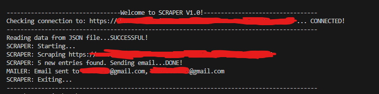

# Python Scraper

Here is a simple scraper (with added history saving) that searches the website provided with a link for a element/list of elements with a specific class or id.

### SCREENSHOT


### HOW TO USE IT
1. Enter the link to website you would like to scrape in the variable URL like this  ```URL="https://www.website.com"``` (line 17)
2. Enter the keywords you would like the scraper to search for like this```keywords=["keyword1", "keyword2", "keyword3"]``` (line 14)
3. Change the "classname" in ```results = soup.find_all("div", {"class": "classname"})``` to the name of the class you are looking for (if you are looking for an id, then change "class" to "id" and "classname" to the id name you are looking for)
4. The lines 65 to 75 are looking for a child element "a", extracting the "href" and shortening the link to tinyurl. You can change it to something else if you would like to do something. 
5. Keep in mind to have variable ```found``` set to "False" before checking for results and if you find one change it to false, to alert via mail.
6. Also add each newly found element in the ```temp_dictionary``` and ```dictionary``` so the program is able to send email with only new results and store them with others for the future.
7. Also set all the variables in the ```alertViaEmail()``` function to your info, so it can send an email correctly. 
8. The ```smtp_email="smtp.gmail.com"``` and ```smtp_port=587``` are already set for gmail's smtp server, please change them if you are using a different provider according to their instructions.
9. Variable ```valueforauth``` is storing the password for your email. When using gmail you need to generate a so called "APP PASSWORD" in your GOOGLE ACCOUNT settings (Security/2-Step-Verification/App Passwords, In a dropdown menu chose other and generate. Copy the generated code to ```valueforauth```).
10. You can also add more than one email address to ```receiver_email```, just keep them in the same string and seperate them with a "," like this ```receiver_email="username@email.com, username2@email.com"```.
11. Enjoy!


